---
## Front matter
title: "Отчёт по лабораторной работе 5"
subtitle: "Структура программы на языке ассемблера NASM. Системные вызовы в OC GNU Linux"
author: "Ошкодер Сергей Александрович"

## Generic otions
lang: ru-RU
toc-title: "Содержание"

## Bibliography
bibliography: bib/cite.bib
csl: pandoc/csl/gost-r-7-0-5-2008-numeric.csl

## Pdf output format
toc: true # Table of contents
toc-depth: 2
lof: true # List of figures
lot: true # List of tables
fontsize: 12pt
linestretch: 1.5
papersize: a4
documentclass: scrreprt
## I18n polyglossia
polyglossia-lang:
  name: russian
  options:
	- spelling=modern
	- babelshorthands=true
polyglossia-otherlangs:
  name: english
## I18n babel
babel-lang: russian
babel-otherlangs: english
## Fonts
mainfont: IBM Plex Serif
romanfont: IBM Plex Serif
sansfont: IBM Plex Sans
monofont: IBM Plex Mono
mathfont: STIX Two Math
mainfontoptions: Ligatures=Common,Ligatures=TeX,Scale=0.94
romanfontoptions: Ligatures=Common,Ligatures=TeX,Scale=0.94
sansfontoptions: Ligatures=Common,Ligatures=TeX,Scale=MatchLowercase,Scale=0.94
monofontoptions: Scale=MatchLowercase,Scale=0.94,FakeStretch=0.9
mathfontoptions:
## Biblatex
biblatex: true
biblio-style: "gost-numeric"
biblatexoptions:
  - parentracker=true
  - backend=biber
  - hyperref=auto
  - language=auto
  - autolang=other*
  - citestyle=gost-numeric
## Pandoc-crossref LaTeX customization
figureTitle: "Рис."
tableTitle: "Таблица"
listingTitle: "Листинг"
lofTitle: "Список иллюстраций"
lotTitle: "Список таблиц"
lolTitle: "Листинги"
## Misc options
indent: true
header-includes:
  - \usepackage{indentfirst}
  - \usepackage{float} # keep figures where there are in the text
  - \floatplacement{figure}{H} # keep figures where there are in the text
---
1. Цель работы
2. Задание
3. Теоритическое введение
4. Выполнение лабороторной работы
5. Вывод

# Цель работы

Изучить структуру программы на языке ассемблера NASM

# Задание

1. Открыть Midnight Commander
2. Создать папку lab05 и внутри нее создать файл lab5-1.asm
3. Открыть файл lab5-1.asm, ввести информацию из листинга 5.1 и сохранить изменения
4. Убедится что файл содержит информацию
5. Оттранслировать текст файла lab5-1.asm, выполнить компановку объектного файла
6. Запустить файл
7. Скачать и скопировать файл in_out.asm с помощью клавиши f5
8. С помощью клавиши f6 скопировать файл lab5-1.asm с именем lab5-2.asm
9. Исправить файл lab5-2.asm в соответствии с листингом 5.2
10. В файле lab5-2.asm заменить подпрограмму sprintLF на sprint
11. Создать исполняемый файл и проверить его работу
12. Создать копию файла lab5-1.asm и внести изменения, чтобы выводила введенная строка на экран
13. Создать копию файла lab5-2.asm и внести изменения, чтобы выводила введенная строка на экран

# Теоретическое введение

Здесь описываются теоретические аспекты, связанные с выполнением работы.

Например, в табл. [-@tbl:std-dir] приведено краткое описание стандартных каталогов Unix.

: Описание некоторых каталогов файловой системы GNU Linux {#tbl:std-dir}
Имя каталога 	Описание каталога
/ 	Корневая директория, содержащая всю файловую
/bin 	Основные системные утилиты, необходимые как в однопользовательском режиме, так и при обычной работе всем пользователям
/etc 	Общесистемные конфигурационные файлы и файлы конфигурации установленных программ
/home 	Содержит домашние директории пользователей, которые, в свою очередь, содержат персональные настройки и данные пользователя
/media 	Точки монтирования для сменных носителей
/root 	Домашняя директория пользователя root
/tmp 	Временные файлы
/usr 	Вторичная иерархия для данных пользователя

Более подробно про Unix см. в [@tanenbaum_book_modern-os_ru; @robbins_book_bash_en; @zarrelli_book_mastering-bash_en; @newham_book_learning-bash_en].

# Выполнение лабораторной работы

1. Открыть Midnight Commander (Cм рис1)

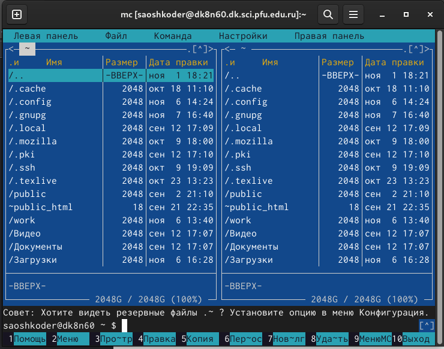{#fig:001 width=100%}
Открытый МС (рис1)

2. Создать папку lab05 и внутри нее создать файл lab5-1.asm (Cм рис )
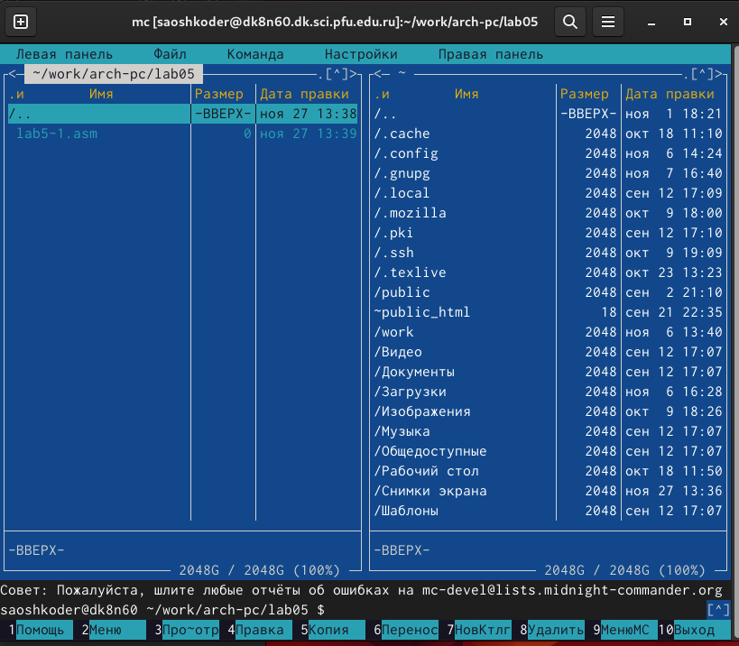{#fig:001 width=100%}
Создание папки lab05 и файла lab5-1.asm (рис2)

3. Открыть файл lab5-1.asm, ввести информацию из листинга 5.1 и сохранить изменения (Cм рис3)
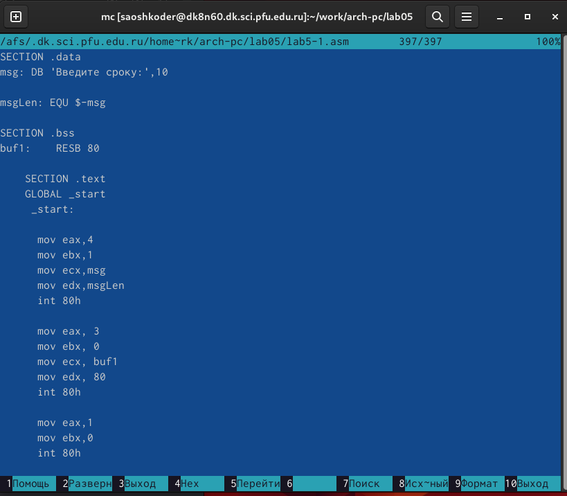{#fig:001 width=100%}
Открытый файл lab5-1.asm (рис 3)

4. Убедится что файл содержит информацию (Cм рис3)
5. Оттранслировать текст файла lab5-1.asm, выполнить компановку объектного файла (Cм рис4)
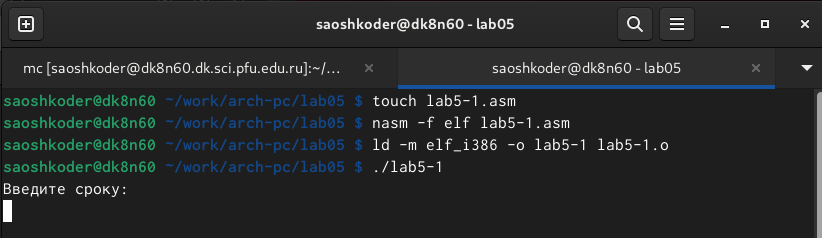{#fig:001 width=100%}
Выполнение команд (рис4)

6. Запустить файл (Cм рис5)
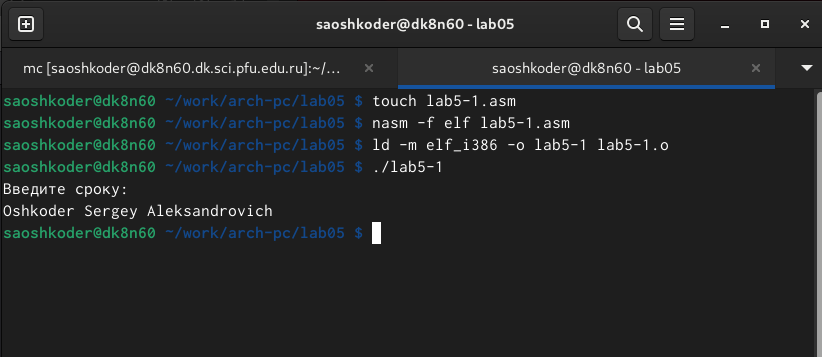{#fig:001 width=100%}
Запуск файла (рис5)

7. Скачать и скопировать файл in_out.asm с помощью клавиши f5 (Cм рис6)
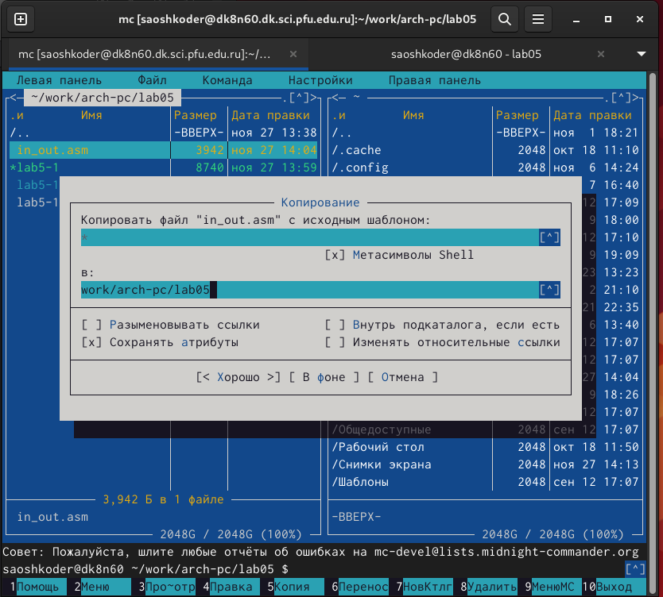{#fig:001 width=100%}
Скопированный in_out.asm через f5 (рис6)

8. С помощью клавиши f6 скопировать файл lab5-1.asm с именем lab5-2.asm (Cм рис7)
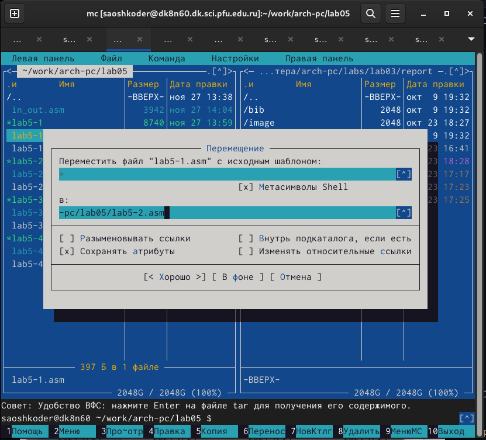{#fig:001 width=100%}
Cкопированный файл lab5-1.asm с именем lab5-2.asm (рис7)

9. Исправить файл lab5-2.asm в соответствии с листингом 5.2 и заменить подпрограмму sprintLF на sprint (Cм рис8)
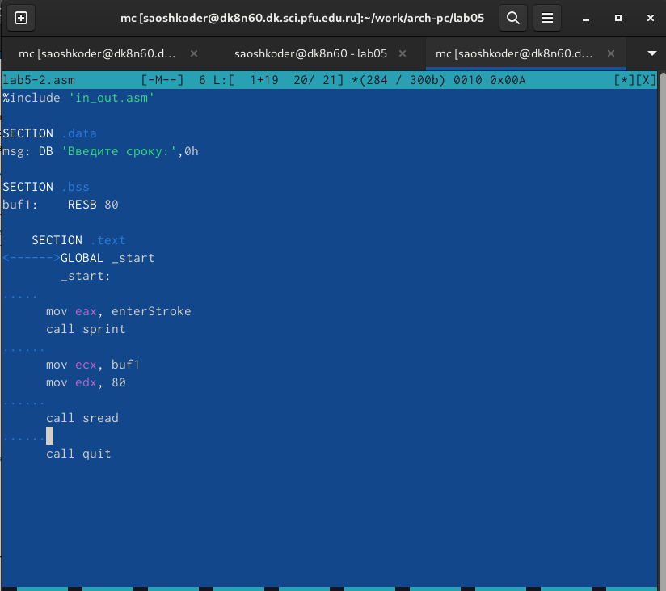{#fig:001 width=100%}
Исправленный файл lab5-2.asm (рис8)

10. Создать исполняемый файл и проверить его работу (Cм рис9)
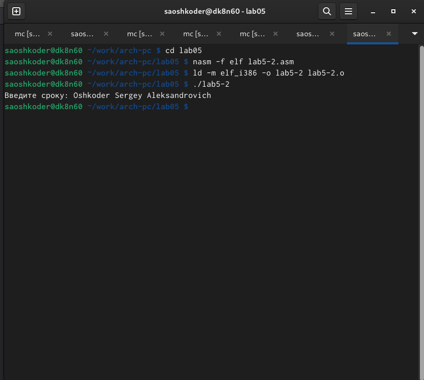{#fig:001 width=100%}
Проверка и создание файла (рис10)
Теперь после вывода сообщения не будет перехода на новую строку

11. Создать копию файла lab5-1.asm и внести изменения, чтобы выводила введенная строка на экран (Cм рис10-11)
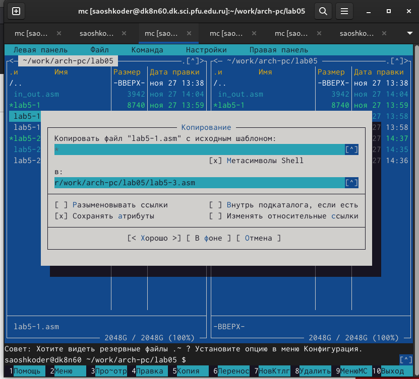{#fig:001 width=100%}
Создание копии файла lab5-1.asm (рис10)
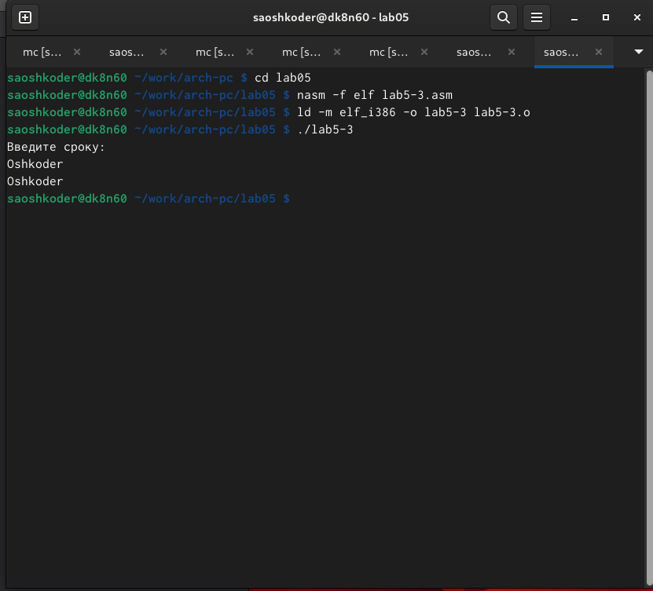{#fig:001 width=100%}
введенной строки на экран (рис 11)

12. Создать копию файла lab5-2.asm и внести изменения, чтобы выводила введенная строка на экран (Cм рис12-13) 
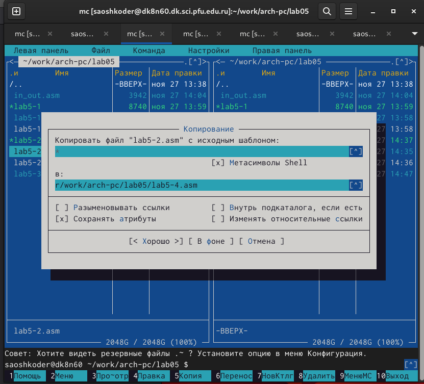{#fig:001 width=100%}
Создание копии файла lab5-1.asm (рис12)
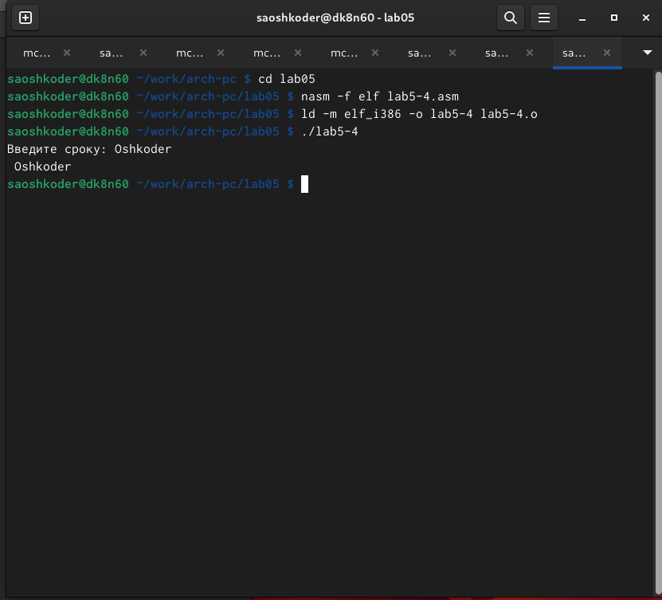{#fig:001 width=100%}
введенной строки на экран (рис13)

# Выводы

В процессе выполнения лабораторной работы я ознакомился со структурой программы на языке ассемблера NASM

# Список литературы{.unnumbered}

::: {#refs}
:::
